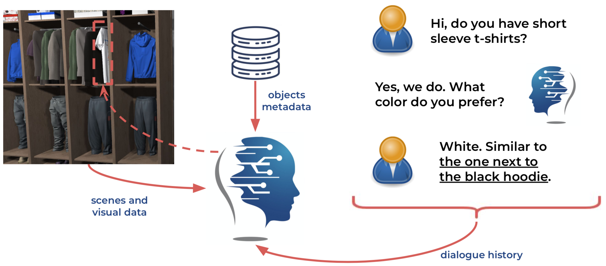
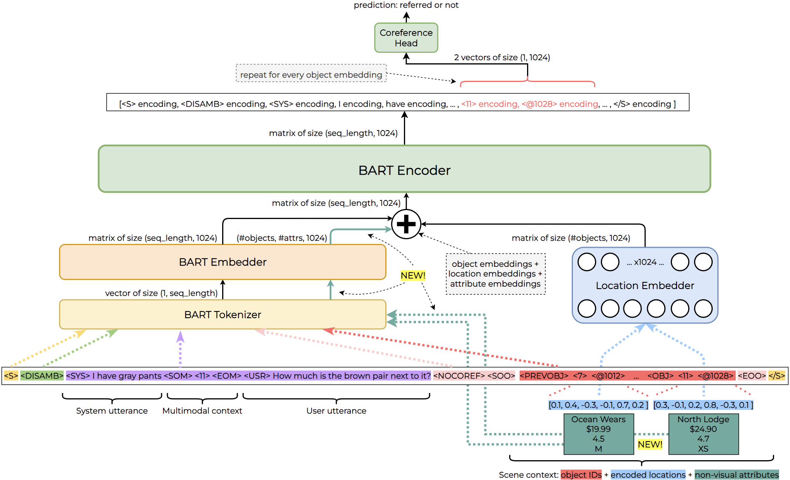
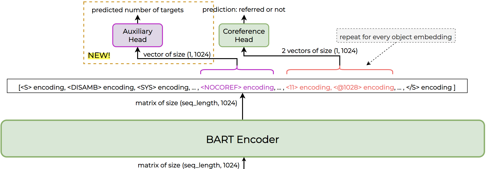
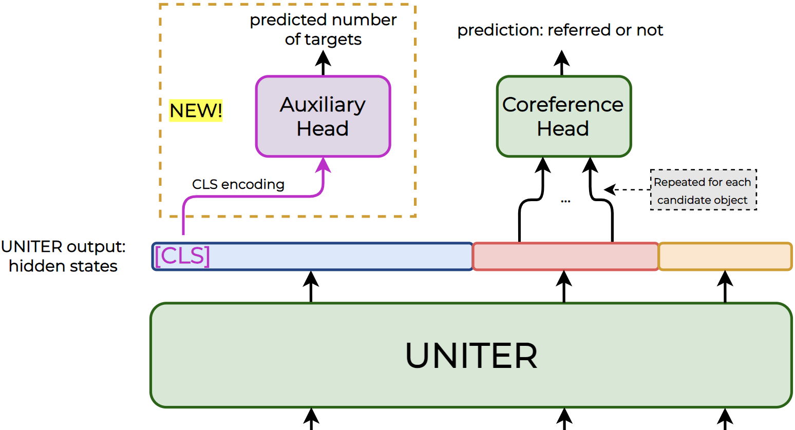

# SIMMC 2.0 Challenge 2021: Multimodal Coreference Resolution task

Project carried out as my **dissertation** for the **MPhil in Machine Learning and Machine Intelligence at the University of Cambridge**.

Multimodal Coreference Resolution is defined as the task of identifying which word or expression co-refer to the same entity within a certain context. The context is defined using both visual (images, videos) and natural language (dialog, textual descriptions) modalities. This is a crucial problem since many visual agents have to link coreferences (e.g. pronouns) to their corresponding general reference (e.g. nouns or noun phrases), and only then solve their main task, such a object grounding or visual question asnwering.

<!---

-->

The [final version of the masters thesis](https://github.com/AlejandroSantorum/simmc2-Multimodal_Coreference_Resolution/tree/main/thesis_report/AlejandroSantorum_MLMI_dissertation.pdf) can be found in [`thesis_report`](https://github.com/AlejandroSantorum/simmc2-Multimodal_Coreference_Resolution/tree/main/thesis_report) directory.

---------------------------------------------
## Challenge overview
The second Situated Interactive MultiModal Conversations (SIMMC 2.0) Challenge 2021. Project focused on the second subtask: Multimodal Coreference Resolution.

The [official GitHub Repository](https://github.com/facebookresearch/simmc2) of the challenge is published by [Meta Research](https://github.com/facebookresearch) team.

The Multimodal Coreference Resolution subtask is proposed as part of the SIMMC2.0 track of the Tenth Dialog System Technology Challenge [DSTC10](https://sites.google.com/dstc.community/dstc10/home).

Clone this repository to download the code and experiments:
```bash
$ git clone https://github.com/AlejandroSantorum/simmc2-Multimodal_Coreference_Resolution.git
```

----------------------------------------------
## Configuration (recommended)

Using a virtual environment is recommended to minimize the chance of conflicts.

#### Setting up a virtual environment: `venv`

In the cloned repository folder, create a virtual environment (you can change the name "env").
```bash
python3 -m venv env
```

Activate the environment "env".
```bash
source env/bin/activate
```

Install requirements using `pip`.
```bash
pip install -r requirements.txt
```
You may need to use `pip3`.
```bash
pip3 install -r requirements.txt
```

#### Python requirements
The requirements to run the code are listed in `requirements.txt`:
* [numpy](https://github.com/numpy/numpy) - The fundamental package for scientific computing with Python
* [torch](https://pytorch.org/) - Optimized tensor Python library for deep learning using GPUs and CPUs.
* [transformers](https://huggingface.co/docs/transformers/index) - State-of-the-art Machine Learning library for PyTorch, TensorFlow and JAX.
* [tqdm](https://github.com/tqdm/tqdm) - Python library to make loops show a smart progress meter.
* [tensorboardX](https://pypi.org/project/tensorboardX/) - Python library to watch tensors flow without Tensorflow.


----------------------------------------------
## Download the Dataset
The dataset is hosted in [Meta's GitHub Repository](https://github.com/facebookresearch/simmc2) with [Git LFS](https://git-lfs.github.com/). The folder [data](https://github.com/facebookresearch/simmc2/tree/main/data) contains the whole dataset and the instructions to be downloaded.

Make sure to install and update Git LFS before cloning the repository:
```bash
$ git lfs install
```

```bash
$ git clone https://github.com/facebookresearch/simmc2.git
```

You may need to pull using Git LFS:
```bash
$ git lfs pull
```

The dataset can also be downloaded from the following link: [data.zip](https://drive.google.com/file/d/1L6k0s4uFvEJZyWRp8N8NtoQ0k_VsV0Kl/view?usp=sharing).

----------------------------------------------
## Models

The folder [`models`](https://github.com/AlejandroSantorum/simmc2-Multimodal_Coreference_Resolution/tree/main/models) contains all the investigated systems in this project:

- [`gpt2_baseline`](https://github.com/AlejandroSantorum/simmc2-Multimodal_Coreference_Resolution/tree/main/models/gpt2_baseline): replication of the baseline model introduced in [*"SIMMC2.0: A Task-oriented Dialog Dataset for Immersive Multimodal Conversations"*](https://aclanthology.org/2021.emnlp-main.401.pdf), using the code from the [SIMMC2.0 repository](https://github.com/facebookresearch/simmc2).
- [`KAIST_BART_based`](https://github.com/AlejandroSantorum/simmc2-Multimodal_Coreference_Resolution/tree/main/models/KAIST_BART_based): replication of the model described in [*"Tackling Situated Multi-Modal Task-Oriented Dialogs with a Single Transformer Model"*](https://openreview.net/forum?id=NajekV9uBas), using the [open source code](https://github.com/KAIST-AILab/DSTC10-SIMMC) of the original team.
- [`bart_coref`](https://github.com/AlejandroSantorum/simmc2-Multimodal_Coreference_Resolution/tree/main/models/bart_coref): previous system modified by removing other task heads that are *not* related with coreference resolution.
- [`bart_only_coref`](https://github.com/AlejandroSantorum/simmc2-Multimodal_Coreference_Resolution/tree/main/models/bart_only_coref): previous system modified by removing all specific-task heads but the one performing coreference resolution. Auxiliary task heads are also deleted. This is the main directory where the majority of experiments on the [BART-based model](https://openreview.net/forum?id=NajekV9uBas) are available and described.
- [`uniter_based`](https://github.com/AlejandroSantorum/simmc2-Multimodal_Coreference_Resolution/tree/main/models/uniter_based): replication of the model described in [*"UNITER-Based Situated Coreference Resolution with Rich Multimodal Input"*](https://arxiv.org/abs/2112.03521), using the [open source code](https://github.com/i-need-sleep/MMCoref_Cleaned) of the original team. This is also the main directory where the majority of experiments on the [UNITER-based model](https://arxiv.org/abs/2112.03521) are available and described.
- [`combined`](https://github.com/AlejandroSantorum/simmc2-Multimodal_Coreference_Resolution/tree/main/models/combined): simple system that combines the predictions of one of the best BART-based models with one of the best UNITER-based models to obtain a boost in performance due to the ensemble of both solutions.


----------------------------------------------
## Main models and improvements

- The **BART-based model** was the main studied system since it was the winner of the DSTC10 challenge. First, we showed that other task-specific heads were not beneficial for the overall performance. Additionally, auxiliary task heads (*empty_coref* and *attributes* heads) were proven to be not helpful.
The **proposed improvements** consist of including textual descriptions of the object in the BART's input in the form of list of attributes, as shown in the following detailed diagram.

<!---

-->
Moreover, including an auxiliary task head that predicts the number of referred objects in the last utterance boosted the overall performance of the model. The object predictions are modified accordingly the output of this auxiliary task head using a set of heuristics.

<!---

-->

- The **UNITER-based model** was studied focusing on its multimodal properties. First, we showed that the usage of object IDs was not necessary and the overall performance increased after removing them. Similar to the BART system, including an auxiliary task head that predicts the number of referred objects in the last utterance boosted the overall performance of the model. The object predictions are again modified accordingly the output of this auxiliary task head using a set of heuristics.

<!---

-->


----------------------------------------------
## License
The project is lecensed under the BSD 3-Clause License. A copy of the [license](https://github.com/AlejandroSantorum/simmc2-Multimodal_Coreference_Resolution/blob/main/LICENSE) can be found along with the code.


----------------------------------------------
## Acknowledgements

I would like to thank my two supervisors, Dr. Svetlana Stoyanchev and Prof. Kate Knill for their countless suggestions, guidance and support throughout the whole project. I am truly grateful for inspiring and teaching me during these last months. I would also like to thank Dr. Simon Keizer and Dr. Rama Doddipatla for their time and insightful discussions at every meeting. I am highly thankful to Toshiba Europe Ltd. for the provided computing resources during the internship, and the Cambridge University Engineering Department for all the given service in the last year.


----------------------------------------------
## Attribution

This project has been developed by Alejandro Santorum Varela (2022) as part of the dissertation for the MPhil in Machine Learning and Machine Intelligence at the University of Cambridge, supervised by Dr. Svetlana Stoyanchev (Toshiba Europe Ltd.) and Dr. Kate Knill (Cambridge University Engineering Department).

If you happen to use the open sourced code of this project in your work or research, please cite it:

A. Santorum, "Multimodal Coreference Resolution", [https://github.com/AlejandroSantorum/simmc2-Multimodal_Coreference_Resolution](https://github.com/AlejandroSantorum/simmc2-Multimodal_Coreference_Resolution), 2022. MLMI MPhil dissertation at the University of Cambridge.

The corresponding BibTex entry is

```
@misc{
    author = {Alejandro Santorum},
    title = {Multimodal Coreference Resolution},
    year = {2022},
    howpublished = {\url{https://github.com/AlejandroSantorum/simmc2-Multimodal_Coreference_Resolution}},
    note = {MLMI MPhil dissertation at the University of Cambridge}
}
```


